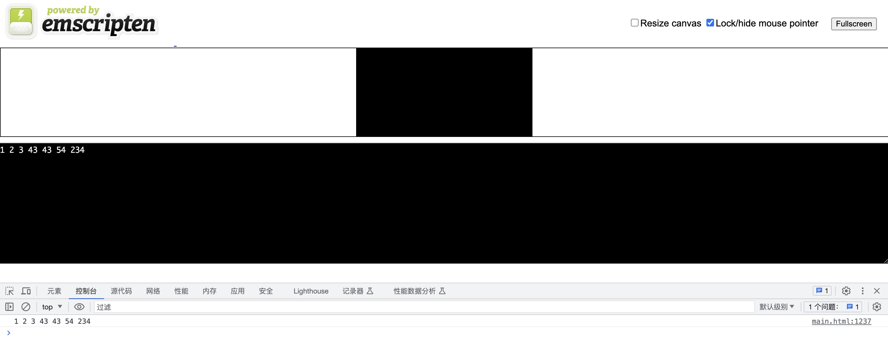
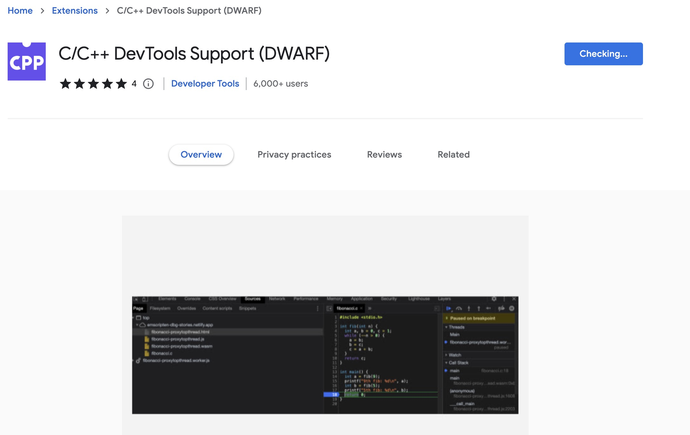
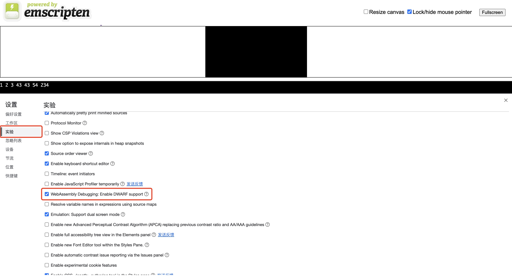
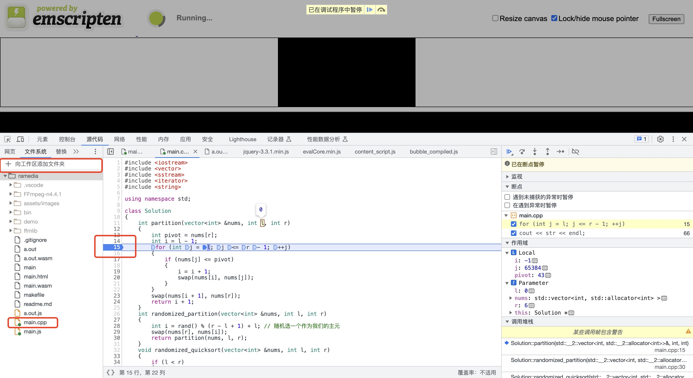

# C++

如果要为 macOS 进行 C++ 开发，建议安装 Clang 编译器。只需在“终端”窗口(Ctrl+Shift+ `)中运行以下命令即可安装命令行开发人员工具:

xcode-select --install

然后，要验证已安装 clang，请在“终端”窗口中运行以下命令。你应该会看到一条消息，其中包含有关所使用的 Clang 版本的信息。

clang --version

```c++
#include<iostream>

using namespace std;

int main(){
    cout << "Hello~" << endl;
    return 0;
}

```

命令行执行：

```sh
clang++ main.cpp 
# if meet some error like this: error: non-aggregate type 'vector<int>' cannot be initialized with an initializer list
# g++ -std=c++11
./a.out 
```

# WebAssembly

官网：<https://emscripten.org/>

Mac 安装 `Emscripten`

```sh
brew install emscripten
```

安装完成后测试是否存在

```sh
emcc -v
```

编译 `C++` 代码

```sh
emcc main.cpp
```

命令成功执行后，你会发现 `main.cpp` 同级目录下会生成两个文件：`a.out.wasm` 和 `a.out.js`。其中，`a.out.wasm` 就是我们想要的 `Wasm` 模块。

```sh
node a.out.js
```

`Node.js` 是支持 `Wasm` 模块的（自 `Node.js 8` 开始）。

如果你希望到浏览器环境下测试文件，那么你可以在命令行下使用如下指令编译我们的 `C++` 代码：

```sh
emcc main.cpp -o main.html
```

命令成功执行后，`main.cpp` 同级目录下会再多出三个文件：`main.wasm`、`main.js` 和 `main.html`。你可以用`Live Server`打开 `main.html` 文件，就能看到结果了:



## 调试 WebAssembly

我们可以在编译 `WebAssembly` 的时候加入 `-v` 参数来让 `Emscripten` 为我们输出更多编译信息，以辅助我们发现 `C++` 代码中的问题。

如果你想在运行期调试 `WebAssembly` 的代码，那么你需要使用如下指令重新编译 `WebAssembly` 模块以让你的 `.wasm` 文件包含调试信息：

```sh
emcc -g main.cpp -o main.html
```

默认情况下 `Emscripten` 编译 `WebAssembly` 模块时会为我们优化掉大部分调试信息，添加 `-g` 指令后，`Emscripten` 将不再为我们优化调试信息。

接着你需要为你的谷歌浏览器安装一个插件 [`C/C++ DevTools Support (DWARF)`](https://chrome.google.com/webstore/detail/cc%20%20-devtools-support-dwa/pdcpmagijalfljmkmjngeonclgbbannb) ，这是 `Chrome DevTools` 开发团队为开发者提供的专门用于调试 `WebAssembly` 的浏览器插件，注意安装过程中要保持良好的网络环境。



安装完成后，打开 `Chrome` 浏览器的调试工具 `DevTools`，点击设置按钮（⚙），打开调试工具的设置面板，勾选实验选项卡下的 `WebAssembly Debugging: Enable DWARF support` 选项。



接着退回到 `DevTools` 主面板，把你的源码路径添加到 `DevTools` 的文件系统中，然后在 `main.cpp` 中下一个断点，刷新 `main.html` 页面，你会发现刚刚下的断点已经命中了，而且调用堆栈也会显示在 `DevTools` 右侧的面板中，如下图所示：



## C++与JS的交互

### ccall

如果需要调用一个在 C 语言自定义的函数，你可以使用 Emscripten 中的 ccall() 函数，以及 EMSCRIPTEN_KEEPALIVE 声明

默认情况下，Emscripten 生成的代码只会调用 main() 函数，其他的函数将被视为无用代码。在一个函数名之前添加 EMSCRIPTEN_KEEPALIVE 能够防止这样的事情发生。你需要导入 emscripten.h 库来使用 EMSCRIPTEN_KEEPALIVE。

```html
<button id="wasm">运行自定义函数</button>

<script type='text/javascript'>
    document.getElementById("wasm").addEventListener("click", function () {
      alert("检查控制台");
      var result = Module.ccall(
        "main", // name of C function
        null, // return type
        null, // argument types
        null,  // arguments
      );
    });
  </script>
```
[](https://emscripten.org/docs/porting/connecting_cpp_and_javascript/Interacting-with-code.html)

```sh
emcc -v main.cpp -o main.html -sEXPORTED_FUNCTIONS=_quick_sort,_main -sEXPORTED_RUNTIME_METHODS=ccall,cwrap
```

### cwrap

`cwrap`的方式会更加简单

```html
<button id="wasm">运行自定义函数</button>

<script type='text/javascript'>
    document.getElementById("wasm").addEventListener("click", function () {
      var main = Module.cwrap('main', null, null) // function name, return type, argument type
      main()
    })
  </script>
```


# FFmpeg

官方地址：<http://ffmpeg.org>

原文链接：<https://itnext.io/build-ffmpeg-webassembly-version-ffmpeg-js-part-1-preparation-ed12bf4c8fac>

为什么要构建 `FFmpeg` 呢？

1. `FFmpeg` 是一个免费的开源项目，由一套庞大的软件库和程序组成，用于处理视频、音频、其他多媒体文件和流。

2. 它非常有用，而且没有一个 `JavaScript` 库具有完全相同的功能。和它最像的是 [ffmpeg.js](https://github.com/Kagami/ffmpeg.js) 和 [videoconverter.js](https://github.com/bgrins/videoconverter.js)。但他们的 `FFmpeg` 和 `Emscripten` 都已经过时了，并且多年来没有维护了。（目前 `FFmpeg` 版本为 `6.0`, `Emscripten` 为 `3.1.42`）

## 一.构建原生 FFmpeg

构建和安装FFmpeg的说明可以在版本库根目录下的 `INSTALL.md` 中找到。

```sh
#!/bin/bash -x
# "nasm/yasm not found or too old. Use --disable-x86asm for a crippled build."
# --enable-shared 开启动态库编译
# --prefix=$(dirname $PWD)/ffmlib 指定输出的目录
# make install 生成
# --disable-optimizations 清除之前的编译污染
./configure --prefix=$(dirname $PWD)/ffmlib --enable-static --enable-shared --disable-doc
make -j
make install
```

开启调试模式

```sh
./configure –-enable-debug
make -j
```

查看可调试的文件

```sh
ls *_g
```
